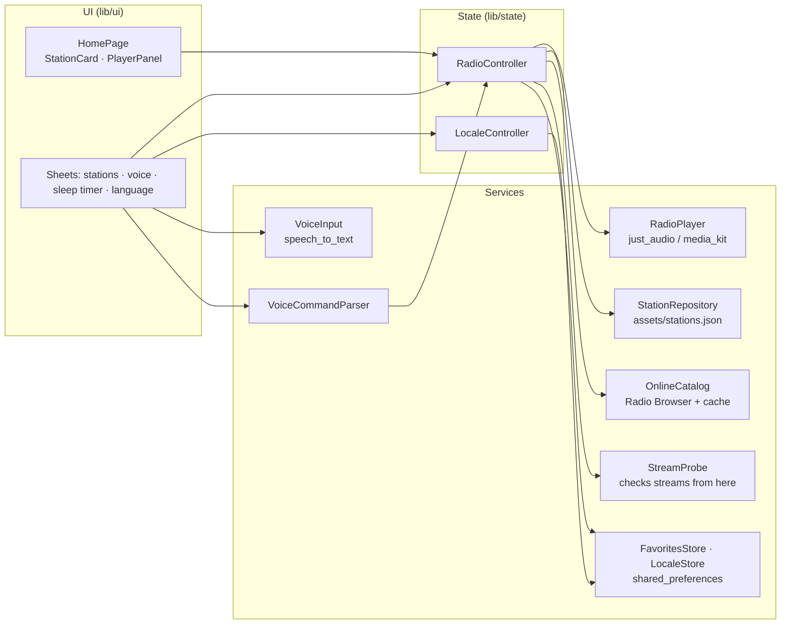

<div align="center">


# Radio

**Internet radio with on-device voice control, built with Flutter for Android, iOS, Windows, macOS, Linux and the web.**

[](https://github.com/Staery/radioapp/actions/workflows/ci.yml)


[](LICENSE)

**English** · [Русский](README.ru.md)

</div>

---

Radio plays hundreds of live stations from Belarus, Russia and around the world: 24 hand-picked ones are built in, and
the rest come from the open [Radio Browser](https://www.radio-browser.info) directory. Show all of them or only
Belarusian, Russian-language or Belarusian-language stations, swipe, tap play, or just say *“play jazz”*, *“next”*,
*“включи ретро”* or *“уключы 92,8”*. Speech is recognised on the device and turned into commands by a small parser,
so there is no cloud assistant, account or API key. The interface is translated into English, Russian and Belarusian.

Some stations only work from Belarus and others only from abroad, so the app checks every stream **from the
listener's own network** and hides the ones that do not open.

## 📸 Screenshots


<sub>The Linux build, from left to right: the station carousel (English), choosing which stations to show (Russian), the station list and a voice command (Belarusian).</sub>

## ✨ Features

| | |
|---|---|
| 📻 **Station carousel** | Large cards with the frequency or logo, genre, country and language; the background takes the colour of the selected station |
| 🌐 **Hundreds of stations** | 24 hand-picked stations plus Belarusian, Russian, Russian-language, Belarusian-language and the most popular world stations from Radio Browser, cached for offline start and refreshed twice a day |
| 🗂 **Which stations to show** | All, featured, Belarus, Russia, in Russian, in Belarusian, in English. The choice is remembered |
| 🛰 **Works from your network** | Every stream is opened from the device in the background; geo-blocked or dead stations are hidden (or marked, if you prefer). A stream that fails while playing is marked too, and *next* skips it |
| 🩹 **Self-healing streams** | When a built-in station moves to a new stream address, the app finds it in Radio Browser and switches over |
| 🎙 **Voice control** | Play, stop, next, previous, a station by frequency (*“106.2”*, *“106 point 2”*, *“94 и 1”*) or name, a genre, *add to favourites*. English, Russian and Belarusian phrases |
| ⌨️ **Typed commands** | The same commands can be typed, for platforms or rooms without a microphone |
| 🌍 **Three languages** | English, Russian, Belarusian. Follows the system language, can be switched in the app and is remembered. Station descriptions are translated too |
| ❤️ **Favourites and genres** | Filter chips for every genre and for favourites; favourites are saved on the device |
| 🔎 **Station list** | Search by name, genre, frequency, city or description in any language |
| 🌙 **Sleep timer** | Stops playback after 15–90 minutes |
| 📡 **Live status** | Connecting / live / error states, the current track title when the stream sends it, a timeout for streams that never start |
| ⌨️ **Keyboard** | Space plays or stops, ← → switch stations on desktop and web |

### Voice commands

| Action | English | Русский | Беларуская |
|---|---|---|---|
| Play | play, start, resume | включи, играй, давай | уключы, грай |
| Stop | stop, pause, quiet | стоп, пауза, выключи | спыні, паўза, хопіць |
| Next / previous | next, skip / previous, back | следующая / предыдущая, назад | наступная / папярэдняя |
| Station | play 106.2, play Radio Paradise | включи 106,2, включи наше радио | уключы 94 і 1 |
| Genre | play jazz, something calm | включи рок, что-нибудь спокойное | уключы рэтра |
| Favourite | add to favourites | добавь в избранное | дадай у абранае |

## 🖥 Platforms

| Platform | Audio | Voice recognition | Build |
|---|---|---|---|
| Android | just_audio (ExoPlayer) | Android SpeechRecognizer | `flutter build apk` |
| iOS | just_audio (AVPlayer) | Speech framework | `flutter build ios` (needs a Mac) |
| Windows | just_audio_media_kit (libmpv) | Windows speech (SAPI) | `flutter build windows` |
| macOS | just_audio (AVPlayer) | Speech framework | `flutter build macos` (needs a Mac) |
| Linux | just_audio_media_kit (libmpv) | — typed commands only | `flutter build linux` |
| Web | HTML audio | Web Speech API (Chrome, Edge) | `flutter build web` |

## 🧱 Tech stack

| Area | Technology |
|---|---|
| Framework | Flutter 3.47, Dart 3.13, Material 3, a custom dark theme with the Inter font |
| State | `provider` + `ChangeNotifier` controllers; widgets only read state and call methods |
| Audio | `just_audio`, `audio_session`, `just_audio_media_kit` on Windows and Linux |
| Voice | `speech_to_text` and an own command parser (`VoiceCommandParser`) |
| Online catalogue | [Radio Browser API](https://api.radio-browser.info) over `http`, with server failover and a local cache |
| Storage | `shared_preferences` for favourites, the language, the scope, stream checks and the catalogue cache |
| Localization | `flutter_localizations` + ARB files (`gen-l10n`) for EN / RU / BE |
| Tests | `flutter_test`: unit tests for parsing, the controller and the parser, widget tests for every screen and language |
| CI/CD | GitHub Actions: analyze and test, then builds for all six platforms; tagged versions are published as releases. `codemagic.yaml` builds the Apple versions without a Mac |

## 🏗 Architecture



- **Platform code sits behind interfaces.** `RadioPlayer`, `VoiceInput`, `StationRepository`, `FavoritesStore` and
  `LocaleStore` have real implementations and test fakes, so the controller and every screen are tested without
  plugins, a microphone or network access.
- **Voice is parsed on the device.** `VoiceCommandParser` normalises the phrase (case, `ё`/`ў`, decimal commas,
  punctuation), then checks stop → navigation → favourite → station (frequency or alias) → genre → play. Russian and
  Belarusian words are stored as stems, so every ending matches.
- **The controller returns data, not text.** A voice command returns a `VoiceReply`; the UI turns it into a localized
  sentence. Errors are stored as the failed station, not as an English message.
- **The station catalogue is data.** `assets/stations.json` holds names, frequencies, countries, languages, colours,
  stream URLs and translated taglines, descriptions and cities. It is validated on load (required fields, http(s)
  URLs, unique ids).
- **Availability is checked where the listener is.** Radio Browser checks streams from servers outside Belarus, so a
  Belarus-only stream looks broken there and a stream blocked in Belarus looks fine. The app therefore downloads
  Belarusian stations without that filter and opens every stream itself (8 at a time, a few kilobytes each). Results
  are kept for a day. If not a single stream opens, the device is offline and nothing is hidden.

### Project layout

```
radioapp/
├── lib/
│   ├── main.dart · app.dart     # wiring, theme, localization
│   ├── models/                  # Station, LocalizedText
│   ├── data/                    # station catalogue, favourites
│   ├── player/                  # RadioPlayer and the just_audio implementation
│   ├── state/                   # RadioController, LocaleController
│   ├── voice/                   # VoiceCommandParser, speech input
│   ├── l10n/                    # app_en.arb, app_ru.arb, app_be.arb (+ generated code)
│   └── ui/                      # home page, widgets, bottom sheets, theme
├── assets/                      # stations.json, Inter font (OFL)
├── test/                        # unit and widget tests
├── android/ ios/ windows/ macos/ linux/ web/
├── scripts/build-windows-android.sh
├── codemagic.yaml
└── .github/workflows/ci.yml
```

## 🛠 What changed compared to the 2021 version

- **Alan AI was replaced by on-device recognition.** The `alan_voice` plugin has not been updated since 2024, uses
  `jcenter()` and Android Gradle Plugin 4 and does not build with current Flutter. It also needed a cloud script and a
  project key, which was committed to the repository. Voice now works without a key or server, in three languages.
- **Commands work as expected.** *Next* and *previous* used to reorder the list without playing anything, the drawer
  items did nothing, and the selected station was read before it was loaded.
- **Moved to Flutter 3 / Dart 3** with null safety, current plugins and regenerated platform projects; `velocity_x`
  and runtime Google Fonts are gone.
- **Station list refreshed.** Dead streams and unrelated pictures were replaced; the stations from Minsk stayed.
- **New:** desktop and web support, localization, favourites, genre filters, search, sleep timer, error and timeout
  handling, keyboard shortcuts, tests and CI.
- `android/local.properties` with local paths is no longer committed.

## 🚀 Getting started

Requirements: [Flutter](https://docs.flutter.dev/get-started/install) 3.47 or newer. Platform tools as usual:
Android Studio for Android, Visual Studio 2022 with *Desktop development with C++* for Windows, Xcode for iOS and
macOS, and on Linux `sudo apt install libgtk-3-dev libmpv-dev libmimalloc-dev`.

```bash
git clone https://github.com/Staery/radioapp.git
cd radioapp
flutter pub get
flutter run                 # pick a device: Android, Windows, Linux, Chrome…
```

```bash
flutter analyze
flutter test                # 123 tests, no device needed
```

Check every built-in stream from your own network (prints OK / FAIL per station):

```bash
dart run tool/check_streams.dart
```

### Release builds

```bash
flutter build apk --release                        # Android
flutter build windows --release                    # Windows
flutter build linux --release                      # Linux (needs libmpv at run time)
flutter build web --release --no-web-resources-cdn # Web
```

On Windows, `bash scripts/build-windows-android.sh` (Git Bash) runs the tests and puts the Android APK and the Windows
zip into `dist/`. Without a Mac, the iOS and macOS versions can be built on [Codemagic](https://codemagic.io) with the
included `codemagic.yaml`, or by the CI workflow.

## ⚠️ Notes

- The streams belong to their broadcasters; the app only plays their public streams. A station may be offline or
  unavailable in some countries.
- The Android release is signed with the debug key so that it installs out of the box; use your own key for a store
  release.

## 📄 License

[MIT](LICENSE) © 2021–2026 Anton Selkin. The Inter font is distributed under the [SIL Open Font License](assets/fonts/OFL.txt).
