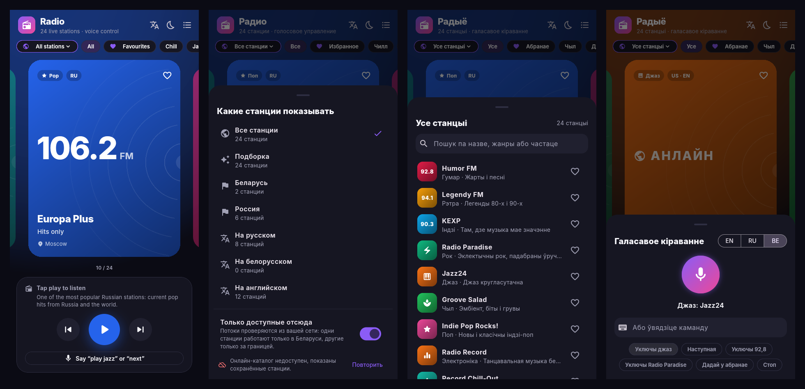
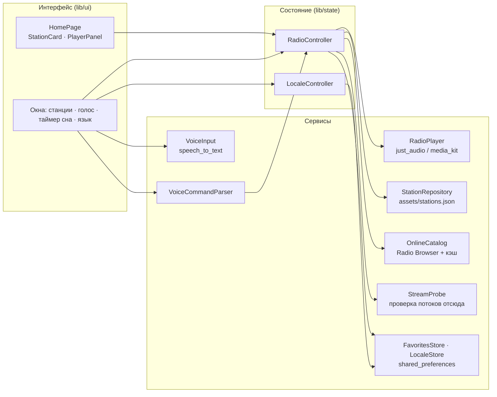

<div align="center">


# Radio

**Интернет-радио с голосовым управлением на устройстве. Flutter-приложение для Android, iOS, Windows, macOS, Linux и веба.**

[](https://github.com/Staery/radioapp/actions/workflows/ci.yml)


[](LICENSE)

[English](README.md) · **Русский**

</div>

---

Radio играет сотни живых станций из Беларуси, России и со всего мира: 24 станции встроены в приложение, остальные
приходят из открытого каталога [Radio Browser](https://www.radio-browser.info). Показывайте все или только белорусские,
русскоязычные или белорусскоязычные станции, листайте, нажимайте «Слушать» или просто скажите *«включи джаз»*,
*«следующая»*, *«play jazz»* или *«уключы 92,8»*. Речь распознаётся на устройстве, а в команды её превращает небольшой
разборщик: облачный ассистент, аккаунт и API-ключ не нужны. Интерфейс переведён на английский, русский и белорусский.

Одни станции работают только в Беларуси, другие только за границей, поэтому приложение проверяет каждый поток **из
сети самого слушателя** и скрывает те, что не открываются.

## 📸 Скриншоты



<sub>Версия для Linux, слева направо: карусель станций (английский), выбор, какие станции показывать (русский), список станций и голосовая команда (белорусский).</sub>

## ✨ Возможности

| | |
|---|---|
| 📻 **Карусель станций** | Крупные карточки с частотой или логотипом, жанром, страной и языком; фон окрашивается в цвет выбранной станции |
| 🌐 **Сотни станций** | 24 станции из подборки плюс белорусские, российские, русскоязычные, белорусскоязычные и самые популярные мировые станции из Radio Browser; каталог кэшируется для запуска без сети и обновляется дважды в день |
| 🗂 **Какие станции показывать** | Все, подборка, Беларусь, Россия, на русском, на белорусском, на английском. Выбор запоминается |
| 🛰 **Проверка из вашей сети** | Каждый поток в фоне открывается с устройства; заблокированные по региону и нерабочие станции скрываются (или помечаются, если так удобнее). Поток, который не открылся при воспроизведении, тоже помечается, и «следующая» его пропускает |
| 🩹 **Самовосстановление потоков** | Если встроенная станция переехала на новый адрес потока, приложение найдёт его в Radio Browser и переключится |
| 🎙 **Голосовое управление** | Включить, остановить, следующая, предыдущая, станция по частоте (*«106,2»*, *«94 и 1»*) или названию, жанр, *в избранное*. Фразы на английском, русском и белорусском |
| ⌨️ **Команды текстом** | Те же команды можно ввести с клавиатуры, если микрофона нет или говорить неудобно |
| 🌍 **Три языка** | Английский, русский, белорусский. Язык берётся из системы, переключается в приложении и запоминается. Описания станций тоже переведены |
| ❤️ **Избранное и жанры** | Фильтры по каждому жанру и по избранному; избранное хранится на устройстве |
| 🔎 **Список станций** | Поиск по названию, жанру, частоте, городу или описанию на любом из языков |
| 🌙 **Таймер сна** | Остановит воспроизведение через 15–90 минут |
| 📡 **Состояние эфира** | Подключение, эфир и ошибка; название текущего трека, если поток его передаёт; таймаут для потоков, которые так и не начали играть |
| ⌨️ **Клавиатура** | Пробел включает и останавливает, ← → переключают станции на компьютере и в браузере |

### Голосовые команды

| Действие | English | Русский | Беларуская |
|---|---|---|---|
| Включить | play, start, resume | включи, играй, давай | уключы, грай |
| Остановить | stop, pause, quiet | стоп, пауза, выключи | спыні, паўза, хопіць |
| Следующая / предыдущая | next, skip / previous, back | следующая / предыдущая, назад | наступная / папярэдняя |
| Станция | play 106.2, play Radio Paradise | включи 106,2, включи наше радио | уключы 94 і 1 |
| Жанр | play jazz, something calm | включи рок, что-нибудь спокойное | уключы рэтра |
| Избранное | add to favourites | добавь в избранное | дадай у абранае |

## 🖥 Платформы

| Платформа | Звук | Распознавание речи | Сборка |
|---|---|---|---|
| Android | just_audio (ExoPlayer) | Android SpeechRecognizer | `flutter build apk` |
| iOS | just_audio (AVPlayer) | Speech framework | `flutter build ios` (нужен Mac) |
| Windows | just_audio_media_kit (libmpv) | распознавание Windows (SAPI) | `flutter build windows` |
| macOS | just_audio (AVPlayer) | Speech framework | `flutter build macos` (нужен Mac) |
| Linux | just_audio_media_kit (libmpv) | — только команды текстом | `flutter build linux` |
| Веб | HTML audio | Web Speech API (Chrome, Edge) | `flutter build web` |

## 🧱 Технологии

| Область | Технологии |
|---|---|
| Фреймворк | Flutter 3.47, Dart 3.13, Material 3, собственная тёмная тема со шрифтом Inter |
| Состояние | `provider` и контроллеры на `ChangeNotifier`; виджеты только читают состояние и вызывают методы |
| Звук | `just_audio`, `audio_session`, `just_audio_media_kit` на Windows и Linux |
| Голос | `speech_to_text` и собственный разборщик команд (`VoiceCommandParser`) |
| Онлайн-каталог | [Radio Browser API](https://api.radio-browser.info) через `http`, с переключением между серверами и локальным кэшем |
| Хранение | `shared_preferences` для избранного, языка, выбора станций, результатов проверки и кэша каталога |
| Локализация | `flutter_localizations` и ARB-файлы (`gen-l10n`) для EN / RU / BE |
| Тесты | `flutter_test`: модульные тесты разбора данных, контроллера и голосовых команд, виджет-тесты всех экранов и языков |
| CI/CD | GitHub Actions: анализ и тесты, затем сборки под все шесть платформ; версии с тегом публикуются как релизы. `codemagic.yaml` собирает версии для Apple без своего Mac |

## 🏗 Архитектура



- **Платформенный код спрятан за интерфейсами.** У `RadioPlayer`, `VoiceInput`, `StationRepository`, `FavoritesStore`
  и `LocaleStore` есть настоящие реализации и тестовые заглушки, поэтому контроллер и все экраны тестируются без
  плагинов, микрофона и сети.
- **Голос разбирается на устройстве.** `VoiceCommandParser` нормализует фразу (регистр, `ё`/`ў`, десятичные запятые,
  знаки препинания), затем проверяет: стоп → навигация → избранное → станция (частота или название) → жанр →
  «включи». Русские и белорусские слова хранятся как основы, поэтому подходят любые окончания.
- **Контроллер возвращает данные, а не текст.** Голосовая команда возвращает `VoiceReply`, а интерфейс превращает его
  в фразу на нужном языке. Ошибка хранится как станция, которая не включилась, а не как английский текст.
- **Каталог станций — это данные.** В `assets/stations.json` лежат названия, частоты, страны, языки, цвета, адреса
  потоков и переводы слоганов, описаний и городов. При загрузке файл проверяется: обязательные поля, адреса http(s),
  уникальные идентификаторы.
- **Доступность проверяется там, где слушатель.** Radio Browser проверяет потоки с серверов за пределами Беларуси,
  поэтому поток, доступный только из РБ, у него выглядит сломанным, а заблокированный в РБ — рабочим. Поэтому
  белорусские станции приложение загружает без этого фильтра и само открывает каждый поток (по 8 одновременно, по
  несколько килобайт). Результаты хранятся сутки. Если не открылся ни один поток, значит, нет сети, и ничего не
  скрывается.

### Структура проекта

```
radioapp/
├── lib/
│   ├── main.dart · app.dart     # сборка зависимостей, тема, локализация
│   ├── models/                  # Station, LocalizedText
│   ├── data/                    # каталог станций, избранное
│   ├── player/                  # RadioPlayer и реализация на just_audio
│   ├── state/                   # RadioController, LocaleController
│   ├── voice/                   # VoiceCommandParser, ввод речи
│   ├── l10n/                    # app_en.arb, app_ru.arb, app_be.arb (+ сгенерированный код)
│   └── ui/                      # главный экран, виджеты, нижние окна, тема
├── assets/                      # stations.json, шрифт Inter (OFL)
├── test/                        # модульные и виджет-тесты
├── android/ ios/ windows/ macos/ linux/ web/
├── scripts/build-windows-android.sh
├── codemagic.yaml
└── .github/workflows/ci.yml
```

## 🛠 Что изменилось по сравнению с версией 2021 года

- **Alan AI заменён распознаванием на устройстве.** Плагин `alan_voice` не обновлялся с 2024 года, использует
  `jcenter()` и Android Gradle Plugin 4 и не собирается с текущим Flutter. Кроме того, ему нужен облачный скрипт и
  ключ проекта, который лежал прямо в репозитории. Теперь голос работает без ключа и сервера и на трёх языках.
- **Команды работают как ожидается.** «Следующая» и «предыдущая» раньше только переставляли список и ничего не
  включали, пункты бокового меню ничего не делали, а выбранная станция читалась до загрузки списка.
- **Переход на Flutter 3 / Dart 3** с null safety, актуальными плагинами и пересозданными платформенными проектами;
  `velocity_x` и загрузка Google Fonts во время работы больше не используются.
- **Обновлён список станций.** Нерабочие потоки и случайные картинки заменены; минские станции остались.
- **Новое:** версии для компьютера и веба, локализация, избранное, фильтры по жанрам, поиск, таймер сна, обработка
  ошибок и таймаутов, горячие клавиши, тесты и CI.
- `android/local.properties` с локальными путями больше не попадает в репозиторий.

## 🚀 Быстрый старт

Нужен [Flutter](https://docs.flutter.dev/get-started/install) 3.47 или новее. Инструменты платформ как обычно:
Android Studio для Android, Visual Studio 2022 с *Desktop development with C++* для Windows, Xcode для iOS и macOS,
а на Linux `sudo apt install libgtk-3-dev libmpv-dev libmimalloc-dev`.

```bash
git clone https://github.com/Staery/radioapp.git
cd radioapp
flutter pub get
flutter run                 # выберите устройство: Android, Windows, Linux, Chrome…
```

```bash
flutter analyze
flutter test                # 123 теста, устройство не нужно
```

Проверить все встроенные потоки из своей сети (для каждой станции выводит OK / FAIL):

```bash
dart run tool/check_streams.dart
```

### Релизные сборки

```bash
flutter build apk --release                        # Android
flutter build windows --release                    # Windows
flutter build linux --release                      # Linux (при запуске нужен libmpv)
flutter build web --release --no-web-resources-cdn # Веб
```

На Windows команда `bash scripts/build-windows-android.sh` (Git Bash) прогоняет тесты и кладёт APK для Android и
zip-архив для Windows в папку `dist/`. Без Mac версии для iOS и macOS можно собрать на [Codemagic](https://codemagic.io)
по приложенному `codemagic.yaml` или в CI.

## ⚠️ Примечания

- Потоки принадлежат радиостанциям; приложение только воспроизводит их публичные трансляции. Станция может временно
  не вещать или быть недоступной в некоторых странах.
- Релизная сборка для Android подписана отладочным ключом, чтобы её можно было сразу установить; для публикации в
  магазине используйте свой ключ.

## 📄 Лицензия

[MIT](LICENSE) © 2021–2026 Anton Selkin. Шрифт Inter распространяется по [SIL Open Font License](assets/fonts/OFL.txt).
